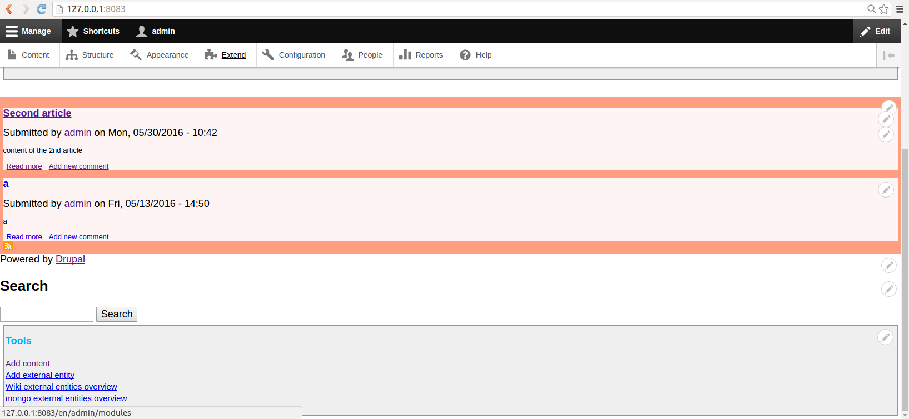
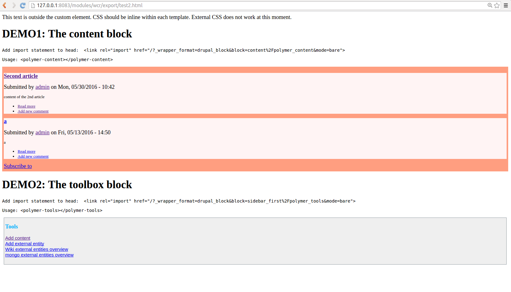

# Renderer(s) for Web Component experiments
## BlockRenderer
BlockRenderer aims to render any block on any page on request. For example, you may choose to render the Main Content block on the frontpage, or the Menu block on `/admin`. 

Combined with ShadowDOM, this allows developers and users to export their Drupal blocks and embed them on external sites.

### Try it yourself (Viewing a single block on a page)
 - Install and enable: module `twig_polymer` and this module. 
 - Visit any page, put `?_wrapper_format=drupal_block` at the end of the URL.
 - You should see a list of blocks in the page.
 - Copy one of the names of the blocks.
 - Add `&block={{block}}` to the URL in your browser. (Note that the parameter should be urlencoded, such as `admin/?_wrapper_format=drupal_block&block=content%2Fseven_content`)
 - You should see only the block you requested.
 - Add `&element=element-name` to the URL, and view the source of the resulting page. You should see the result is wrapped as a Polymer element.

### Try it yourself (Embedding blocks on static page)
 - Install and enable: module `twig_polymer` and this module. 
 - Set theme `polymer` as default. (https://github.com/ztl8702/polymer)
 - Visit homepage at `http://siteurl/`. Compare what you see with the next step.

 - Visit `http://siteurl/modules/wcr/export/test_static.html`. 

 - You should see the main content block embedded on the static page.

### How to embed a block on a static page
 - Include the polyfill in `<head>` (at this moment, the polyfill is inside the module `twig_polymer`, due to the fact that Drupal 8's support for 3rd party Javascript library is not mature)
```
<script src="/modules/twig_polymer/bower_components/webcomponentsjs/webcomponents-lite.min.js?v=1.x"></script>
```
 - In `<head>` also import the element for the block:
```
<link rel="import" href="/?_wrapper_format=drupal_block&block=content%2Fpolymer_content&mode=bare"></link>
```
 - In `<body>` of your static page, use the element you just imported:
```
<polymer-content></polymer-content> 
```
 - You can view the source code of `test_static.html` for more details.
 
### Limitations
 - External CSS and JS doesn't work for custom themes yet.
