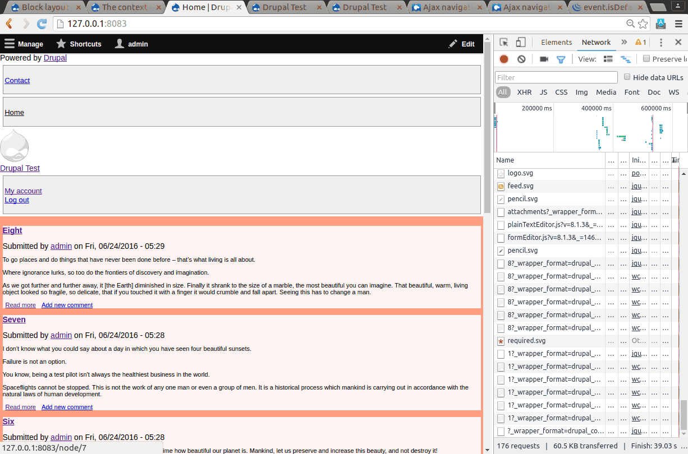
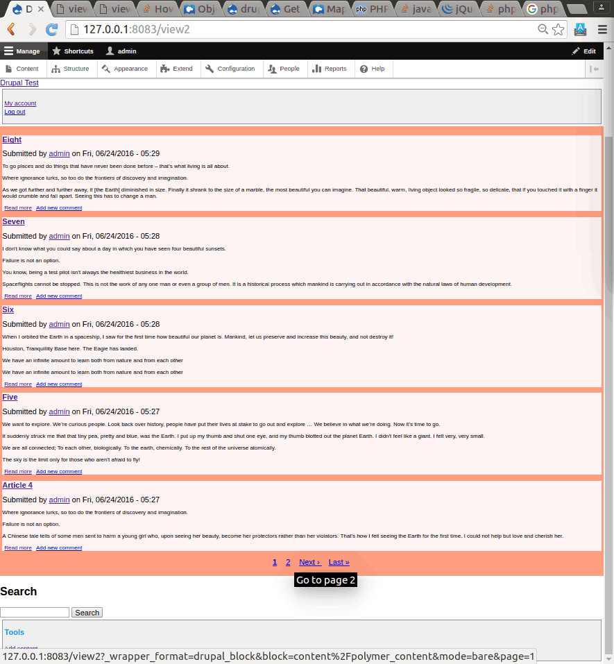
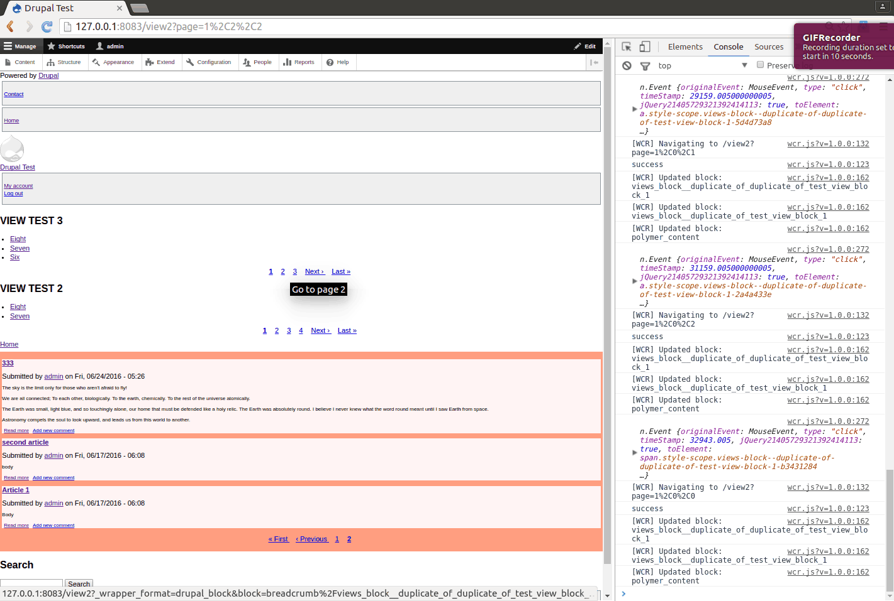

# Test Steps for Non-refresh Navigation with Componentized Blocks
## Requirements
 - Drupal 8.1.3
 - Chrome / Chromium 50+ (Other browsers have not been tested.)

## Installation
 - Download `polymer` theme to `/themes` folder. (https://github.com/ztl8702/polymer)
 - Download `twig_polymer` module to `/modules` folder. (https://github.com/ztl8702/twig_polymer)
 - Goto `/modules/twig_polymer` add run `bower install` to install 3rd party dependencies.
 - Login to Drupal as `admin`.
 - Add a few articles for testing purposes. Make sure you have enough articles to activate the pager (6 or 7 should be sufficient). 
 - Create a view with the following settings (you can clone the `frontpage` view and modify it):
   - Display: Block
   - Format: HTML List
   - Fields: Content: Title
   - Pager: Paged, 2; Pager ID: 1
 - In Block Layout settings, find the View block you just created and put it on the page. (To test a page with/ without a Views block, you may choose to display this block only on specific pages.)
 - Go to Appearance setting, enable and set theme `Polymer` as default. 
 - Run drush command `drush en wcr` to enable module `wcr` and its dependencies. (Make sure you do this step at the very end, because `wcr` has not been tested on admin themes yet)
 - Clear cache `drush cr`.
 
## Test 1

Go to the frontpage of the site and try clicking on a few links, navigating between the frontpage, a node page, or a user profile page.

Open your browser's Console to see what blocks are being updated.

## Test 2 Single View with pager

Go to a View page (the frontpage itself is a View), and try navigating between different pages by clicking on the pager.

## Test 3 Multiple Views with pagers

Go to a View page (the frontpage itself is a View) with another View block (like the one you created before), and try navigating between different pages by clicking on any of the pagers.

## Notes
 - The address bar is not being updated at this moment.
 - You may experience some "jumps" in the UI. This is because loading new block element takes time, and currently I am not waiting until the new block is loaded before removing the old block.
 - Back / forward button support hasn't been implemented.
 - If you want to change settings, you need to disable module `wcr` first. This is due to: 1) admin theme is not yet supported; 2) navigation between pages with different themes (e.g. from user theme to admin theme or the opposite) requires more work in the future.
 - External CSS files and Javascript support is not complete.
